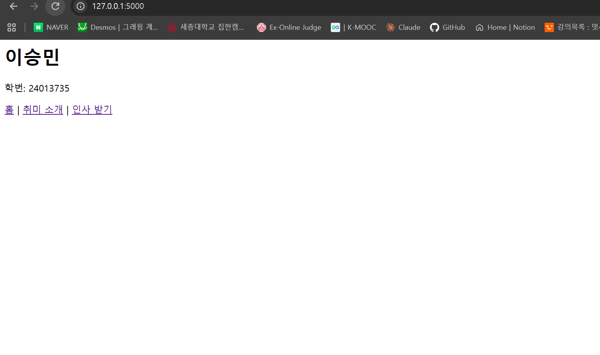
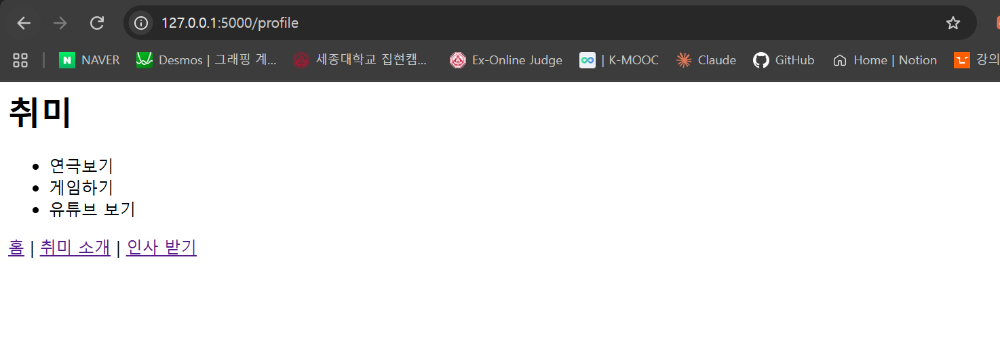
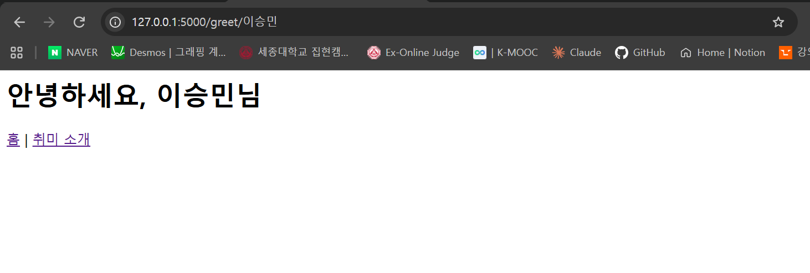

# HW1 — 나를 소개하는 미니 사이트

- 이름: 이승민
- 학번: 24013735

## 폴더 설명

- `app.py` — 라우팅 세 개 (`/`, `/profile`, `/greet/<name>`)
- `templates/` — 각 라우트에 대응하는 html 템플릿

## 실행 방법

```
cd HW1
flask run
```

## 실행 화면

| 초기화면 | 취미화면 | 이름화면 |
|:---:|:---:|:---:|
|  |  |  |
