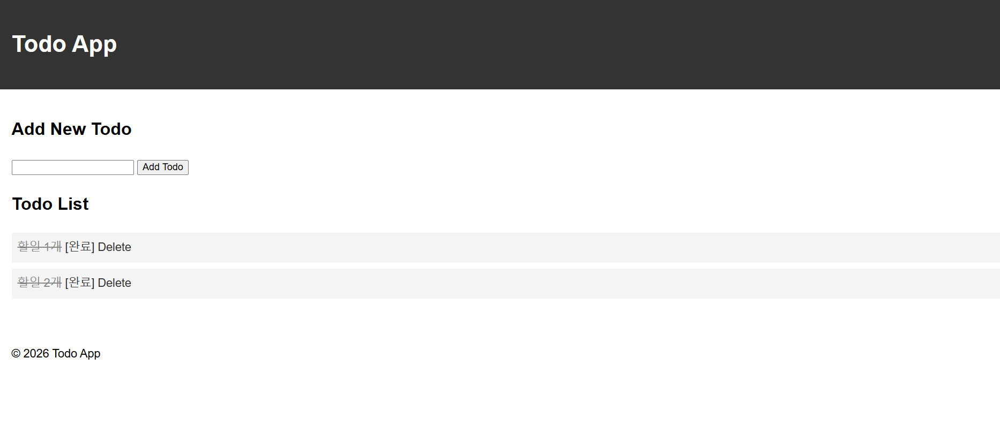

# HW2 — Todo 앱에 완료 체크 기능 추가

- 이름: 이승민
- 학번: 24013735

## 폴더 설명

- `app.py` — 목록/추가(`/`), 삭제(`/delete/<int:index>`), 완료 토글(`/toggle/<int:index>`)
- `templates/` — `base.html`(공통 틀), `index.html`(목록과 입력창)
- `static/style.css` — 화면 꾸밈과 완료 항목 취소선

## 실행 방법

```
cd HW2
flask --debug run
```

## 실행 화면

### 1. 할 일 두 개가 있는 목록

![할 일 두 개가 있는 목록: "할일 1개", "할일 2개" 각 줄 옆에 [완료]와 Delete 링크가 있다](images/1-list.png)

- 화면 설명: "할일 1개", "할일 2개" 두 항목이 목록에 있고, 각 항목 옆에 `[완료]`와 `Delete` 링크가 보입니다. 아직 줄이 그어진 항목은 없습니다.

### 2. 하나를 [완료] 눌러 줄이 그어진 화면

![[완료]를 누른 항목에 취소선이 그어진 화면](images/2-done.png)

- 화면 설명: `[완료]`를 누른 항목의 글자에 취소선(`line-through`)이 그어지고 회색으로 바뀝니다. `[완료]`를 한 번 더 누르면 줄이 사라집니다.

### 3. 새로고침한 뒤에도 줄이 남아 있는 화면



- 화면 설명: 새로고침(F5)을 해도 `done` 값이 서버 메모리에 저장되어 있어 취소선이 그대로 유지됩니다. (서버를 껐다 켜면 목록이 비는 것은 정상입니다.)
